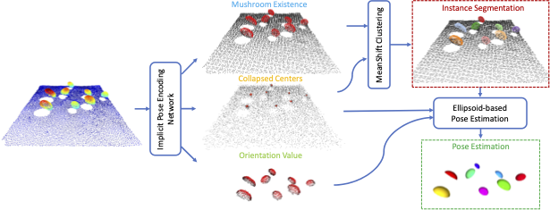

# Mushroom Segmentation and 3D Pose Estimation from Point Clouds using Fully Convolutional Geometric Features and Implicit Pose Encoding

This is the official PyTorch implementation of the ["Mushroom Segmentation and 3D Pose Estimation from Point Clouds using Fully Convolutional Geometric Features and Implicit Pose Encoding"](https://openaccess.thecvf.com/content/CVPR2023W/AgriVision/papers/Retsinas_Mushroom_Segmentation_and_3D_Pose_Estimation_From_Point_Clouds_Using_CVPRW_2023_paper.pdf) paper appeared in CVPRW 2023 (Vision for Agriculture).

<p align="center"> 

*Overview of the proposed system. Given a point cloud input of a mushroom scene, the proposed deep network predicts the three categories of task-relevant information. Using a mode-seeking clustering over the predicted centers we can provide the instance segmentation result. Then each mushroom region is processed as an ellipsoid structure and the corresponding 3D pose is estimated.*
</p>


## Installation
The deep learning backbone is a sparse 3D convolution network as in [Fully Convolutional Geometric Features](https://github.com/chrischoy/FCGF).
This network requires to have a working version of [Minkowski Engine](https://github.com/NVIDIA/MinkowskiEngine).
The following commands provided a working conda enviroment for a Python 3.9 setup with CUDA 11.7:

```bash
conda create -n mpose python=3.9
conda activate mpose

conda install openblas-devel -c anaconda
conda install pytorch=2.0.1 torchvision cudatoolkit=11.0 -c pytorch -c conda-forge
pip install -U git+https://github.com/NVIDIA/MinkowskiEngine -v --no-deps --install-option="--blas_include_dirs=${CONDA_PREFIX}/include" --install-option="--blas=openblas"

pip install open3d 
```

If Minkowski Engine installation fails, check out the alternatives in the original [repo](https://github.com/NVIDIA/MinkowskiEngine).


## Demo 
We provide a demo that can be used to test a pretrained model on some examples of pointclouds. 

```bash
python run.py example_pcds/example_2.pcd trained_model.pt
```

The first argument is the path to the point cloud input, while the second is the path to a trained model. Both a set of inputs, as well as an already trained model are provided.

This code provides a visualization of the final detection through [Open3D](https://www.open3d.org) library. To also support headless executions, the visualization is depicted on localhost:8888 and a port forwarding is required. 
## Training

Further training can be performed via:

```bash
python train_scenes.pt
```

This code generates on the fly synthetic mushroom scenes and train the 3D model on them.

## Citation
If you find this work useful, please consider citing:

```bibtex
@inproceedings{retsinas2023mushroom,
  title={Mushroom Segmentation and 3D Pose Estimation from Point Clouds using Fully Convolutional Geometric Features and Implicit Pose Encoding},
  author={Retsinas, George and Efthymiou, Niki and Maragos, Petros},
  booktitle={Proceedings of the IEEE/CVF Conference on Computer Vision and Pattern Recognition},
  pages={6263--6270},
  year={2023}
}
```


## Acknowledgements 
We acknowledge the following repositories and papers that were used in this work:

- [Fully Convolutional Geometric Features](https://github.com/chrischoy/FCGF)
- [Minkowski Engine](https://github.com/NVIDIA/MinkowskiEngine)
